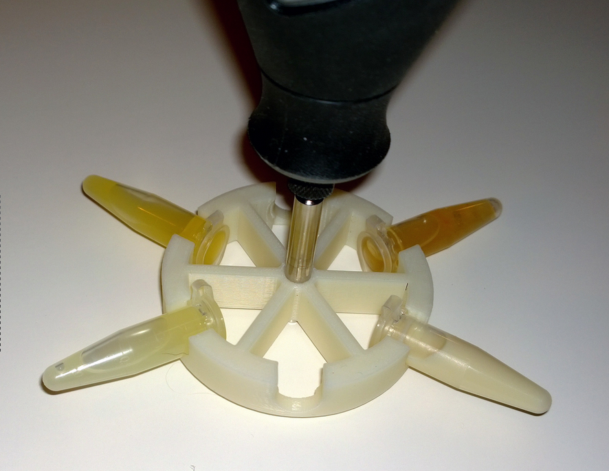

# Dremelfuge
#### One-piece centrifuge rotor for common rotary tools
by Cathal Garvey, (C) 2009, colicensed under the GNU GPL v3 or later and the Creative Commons Attribution, Sharealike license v4 or later.

* Twitter: [@onetruecathal](https://twitter.com/onetruecathal)
* Gittip (Support more Free/Libre Biotech): [onetruecathal](https://www.gittip.com/onetruecathal/) 
* Bitcoin donations: 
* [Dremelfuges for Purchase (as ornaments)](http://www.shapeways.com/model/77306/dremelfuge-classic.html?materialId=6)
* [Other Nice Stuff For Purchase](http://www.shapeways.com/designer/onetruecathal)

## I'm Easily Distracted Tell Me What This Is
This is a one-piece, 3D printable centrifuge rotor that can hold up to six eppendorf-style
1.5ml microcentrifuge tubes and spin them pretty damned fast. You can use it for laboratory
operations like separating fluids, isolating free-floating cells, clarifying small volumes
of liquid, emergency medicine, etcetera.

At least, you could do all of that hypothetically, if you were to actually use a Dremelfuge,
which I don't endorse. I [sell Dremelfuges](http://www.shapeways.com/model/77306/dremelfuge-classic.html?materialId=6) as ornaments and memorabilia of the bad-old-days of
3D printing and DIYbio, and I caution that using Dremelfuges carries an eye-loss risk as well
as whatever risks are inherited from spinning the fluids in question at high velocities.

## Tell Me A Story
In 2009, when I was starting to collect and buy equipment to build what would become
my home-lab, I found there was a general need in the DIYbio community for an affordable
centrifuge. There was also, of course, a general need globally of a cheap, easily-maintained
and transport-friendly centrifuge for medical use in deprived or disaster-hit areas, something
I was only peripherally aware of until researching the subject.

At that time I was still in honeymoon-period with my Makerbot Cupcake, one of the first
consumer-end 3D printers ever and Makerbot Industries' first open-source printer (sadly,
they have since ceased producing open source printers despite making their first $million selling
products licensed openly and unpatented). It seemed natural to attempt 3D printing a rotor,
which I could then attach to a rotary tool to make a centrifuge.

I realised after a quick inspection of the tools at hand that drills were generally
not fast enough by far, built as they are to provide a balance of speed and torque.
Dremels and other rotary multitools, on the other hand, commonly achieve rotary speeds
of 30,000 RPM and are explicitly designed to tolerate forces against the axis of rotation;
perfect for a centrifuge!

It took some time to design the first printable model. I worked in OpenSCAD, an excellent
piece of Free/Libre modelling software that uses a C-like scripting language to "describe"
components as aggregates and boolean products of fundamental types such as spheres, cylinders
and cuboids. The disadvantage is slowness in the initial design, but the payoff comes later
when the design becomes parameterisable, and where the precise layout of the design is
mathematically guaranteed to conform to your needs. For something I was hoping to spin at
30,000 it was pretty much a requirement that there be no errors in balance or layout!

The initial designs were embarassingly buggy, attempting to minimise spokes and maximise tube
capacity. On the sage advice of my father I moved instead to a six-spoke, six-tube arrangement
which has stuck, and printed my first functioning rotors.

The first design, which went on sale as an ornament and even sold to two people (one of
whom remains unidentified!) was still buggy, having as it did a poorly designed "seat" for
the centrifuge tubes which would allow the tubes to eject at high speed above certain
angular velocities! After observing the design of more conventional centrifuges I realised
that the retaining force came not from gripping the sides of the tubes, as I was attempting,
but rather from the 0.5mm "shelf" surrounding the lip of the tube, which sat at the mouth
of the tube seats in conventional rotors. A quick redesign of the model in OpenSCAD, and I
had Dremelfuge in its current form. It's been lurking quietly on [Thingiverse](http://www.thingiverse.com/thing:1483) and [Shapeways](http://www.shapeways.com/model/77306/dremelfuge-classic.html?materialId=6) ever since.

Since then, Dremelfuge has gone on to become a symbol for DIYbio overall, and has become an
unexpectedly enduring talking-point for me. It's been featured in [Nature](http://www.nature.com/news/2010/101006/full/467650a.html), [Makezine](http://makezine.com/2009/12/23/laboratory-centrifuge-attachment-fo/), and [at least one book](http://www.amazon.com/Open-Source-Lab-Hardware-Reduce-Research/dp/0124104622).
It's been bought enough times from [Shapeways](http://www.shapeways.com/model/77306/dremelfuge-classic.html?materialId=6)
to contribute a little bit to my other biotech products (though not overall that much), and 
it's been downloaded or printed by thousands (I have no firm way to know).

After these years of intervening work, Dremelfuge remains. My own lab is now closed for want
of funding, my GM-license expired, and I'm at a crossroads career-wise. While assembling
CVs and other documentation of jobseeking, I realised I'd never posted Dremelfuge to Github,
so; here it is. I hope it's of use to you!

## Usage
Don't use this. I used it for years, with little injury, but it's provided as an ornament only
to others as it remains a highly risky way to centrifuge things. Unbalanced rotors may vibrate,
move, lose control or eject tubes at high velocity. Spinning a rotor this large wears out Dremels
somewhat fast. The best way to use this is to hang it on a tree and tell people about it.

Print dremelfuge in ABS only, NOT Polylactic Acid (PLA). Violent things have been observed to result
from printing dremelfuges in PLA and, against my formal recommendation, spinning them. When printing,
neither scrimp nor splurge on infill, but make sure the infill meets and fuses with the shell of the
print to confer proper structural strength. An infill pattern that provides strong rigidity, such
as hexagonal or cube infill, would be best.

Dremelfuge is designed to fit the cutting-disk holder of a standard Dremel 3000 series tool.
If you have a different cutting tool with varying dimensions, you can change some parameters
in the `Dremelfuge V4.scad` file and re-compile using [OpenSCAD](http://www.openscad.org/) to
get a printable STL file.

## Credits
Thanks to [Kalani Kirk Hausman](https://twitter.com/KKHausman) for letting me use his photograph of
a dremelfuge to represent the device; my own camera skills are severely lacking!

Thanks to Catarina Mota for the `shapes.scad` library (included) which made it easier to design
Dremelfuge in the first place. I've met Catarina in person since (at [TED Global](www.ted.com/speakers/catarina_mota)), and [she's awesome](http://www.openmaterials.org/catarina/).

Thanks to my dad for going halves on a 3D printer in the first place, and for design input! :)

Thanks to my wife Niamh for years of patience with my biotech experimentation.
